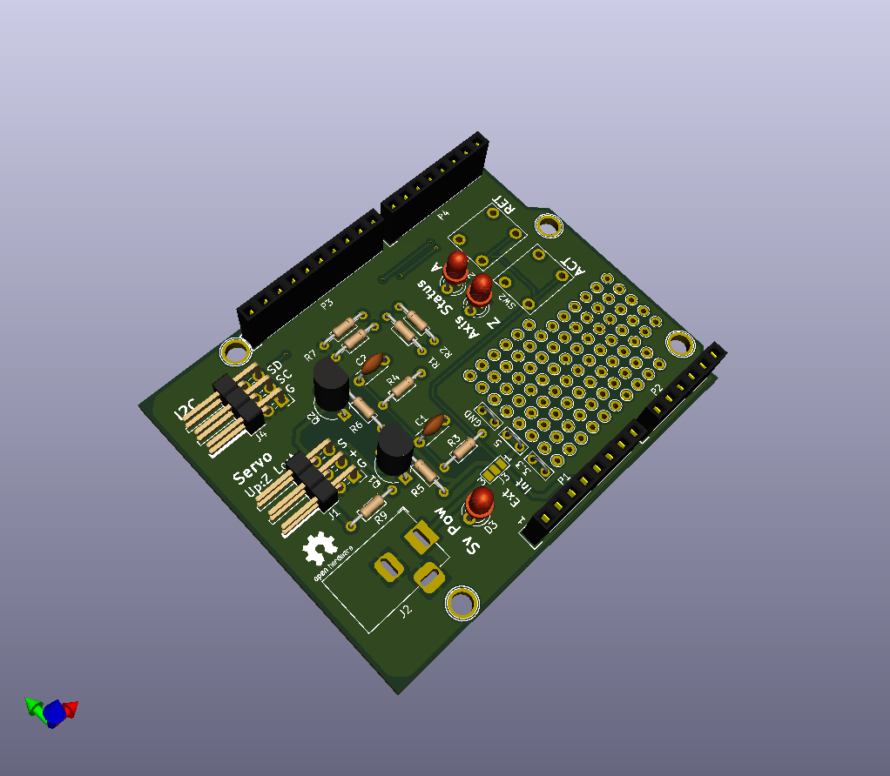

# アイロンビーズセッター　エンドエフェクタ制御基板

- 回路図
  - [PDF](./BeadsEe_sch.pdf/)

- 基板パターン図
  - [PDF](./BeadsEe_pcb.pdf)

## 1.Requirement

- KiCAD 5.x

## 4.Note

注意点など

## 5.Author

* myasu
  * https://github.com/trihome/
* 瀬戸内ROS勉強会
  * https://ros.xrea.jp/

## 6.License

This is under [CC-BY-SA](https://creativecommons.org/licenses/by-sa/4.0/).
